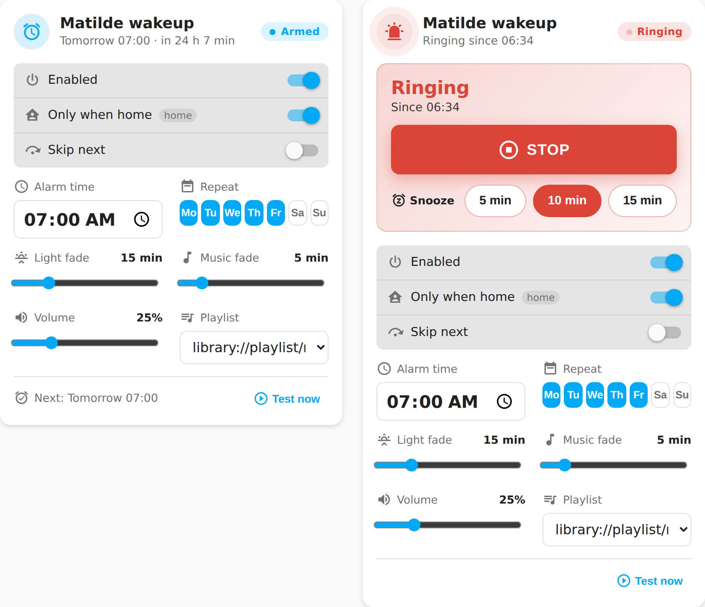
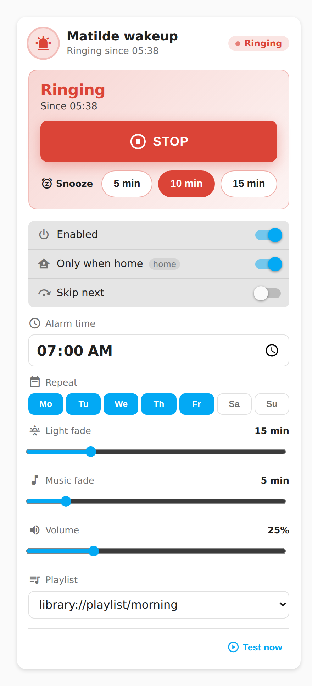

# Lovelace Personal Wakeup Card

A dashboard card for the
[Personal Wakeup](https://github.com/mvheimburg/personal-wakeup)
integration.



- Big **Stop** button and one-tap **Snooze** presets while the alarm is
  rising, ringing or snoozed.
- Compact main card with status, next alarm countdown, Enabled and Skip next.
- Gear button opens settings for alarm time, weekdays, fades, volume, playlist,
  presence checking, and **Test now**.
- Select the wakeup light, music player, and optional people in the modal.
  These selections persist in the integration options. Changing a selection
  stops an active alarm or snooze before applying it.
- Close settings with the close button, Escape, or a click outside the modal.
- Failed service calls show a Home Assistant toast instead of failing silently.

On a phone the card stacks into a single column, with the Stop button and the
snooze presets sized for a half-asleep thumb:



## Wakeup configuration (0.4.0)

New controls require **Personal Wakeup integration 0.4.0 or later**. An older
integration keeps its existing controls and shows an upgrade notice.

- Choose **Lights only**, **Music only**, or **Lights and music**. Only enabled
  channels show their target selectors, fades, volume and playlist controls.
  Select any missing target, then press **Save configuration** to apply the mode
  and targets together. Changing these settings stops an active alarm.
- Select multiple people. **Only when home** allows scheduled alarms when any
  selected person is home; unavailable/unknown people do not count as home.
  Clearing the selection removes presence restrictions. Test now and snooze
  remain manual actions and bypass presence checking.
- Each of the seven weekday rows has an enabled button and a time. **Default**
  inherits Alarm time; editing a day's time creates an override. **Reset** removes
  that override. Disabled days retain their times. At least one day must remain
  selected; turn off **Enabled** to suspend all alarms.
- Mode, targets, people, enabled weekdays and daily overrides are staged until
  **Save configuration**. Closing the dialog retains drafts; **Discard changes**
  restores reported settings. Errors retain the draft and appear in the dialog
  and a Home Assistant toast. Other controls apply immediately.

The card uses the alarm sensor's friendly name unless `name` is explicitly set
in the card configuration. Integration 0.4.0 names new sensors after their alarm
entry; existing entity IDs and manually customized names remain stable.

## Install

### HACS
Add this repository as a custom repository (category *Dashboard*) and install
**Personal Wakeup Card**. HACS registers the resource for you.

### Manual
1. Copy `dist/lovelace-personal-wakeup-card.js` to `config/www/`.
2. Add `/local/lovelace-personal-wakeup-card.js` as a *JavaScript module*
   resource under **Settings → Dashboards → Resources**.

## Card config

```yaml
type: custom:lovelace-personal-wakeup-card
entity: sensor.matilde_wakeup
name: Matilde           # optional, defaults to the entity's friendly name
snooze_presets: [5, 10, 15]   # optional, minutes; the entity's default snooze is always included
```

The visual editor offers the same options.

## Appearance

Choose **Default** or **Bubble** in the dashboard card editor, or add
`appearance: bubble` to the card YAML. Omitting it keeps the default appearance.
The Bubble preset styles both the compact card and its settings modal; it does
not require Bubble Card to be installed.

The preset inherits these shared CSS variables from your Home Assistant theme:
`--bubble-main-background-color`, `--bubble-secondary-background-color`,
`--bubble-accent-color`, `--bubble-border-radius`, `--bubble-icon-border-radius`,
`--bubble-icon-background-color`, `--bubble-sub-button-border-radius`,
`--bubble-sub-button-background-color`, `--bubble-border`, and
`--bubble-box-shadow`. Without overrides it uses the current HA theme colors
and rounded Bubble-style defaults. Alarm warning and stop colors stay distinct.

For example, in an HA theme (theme keys omit the leading `--`):

```yaml
bubble-border-radius: 28px
bubble-accent-color: "#009688"
```

CSS applied locally inside another Bubble Card does not carry over. This is
a visual preset, not support for Bubble Card modules or its pop-up engine.

## Build

```bash
npm ci
npx playwright install chromium
npm test          # real card DOM and service payloads in Chromium
npm run lint
npm run typecheck
npm run build      # writes dist/lovelace-personal-wakeup-card.js
```

CI checks that `dist/` is committed up to date. Releases are automatic: bump
`version` in `package.json`, merge to `main`, and the release workflow tags
`v<version>` and attaches the built card to a GitHub release.
