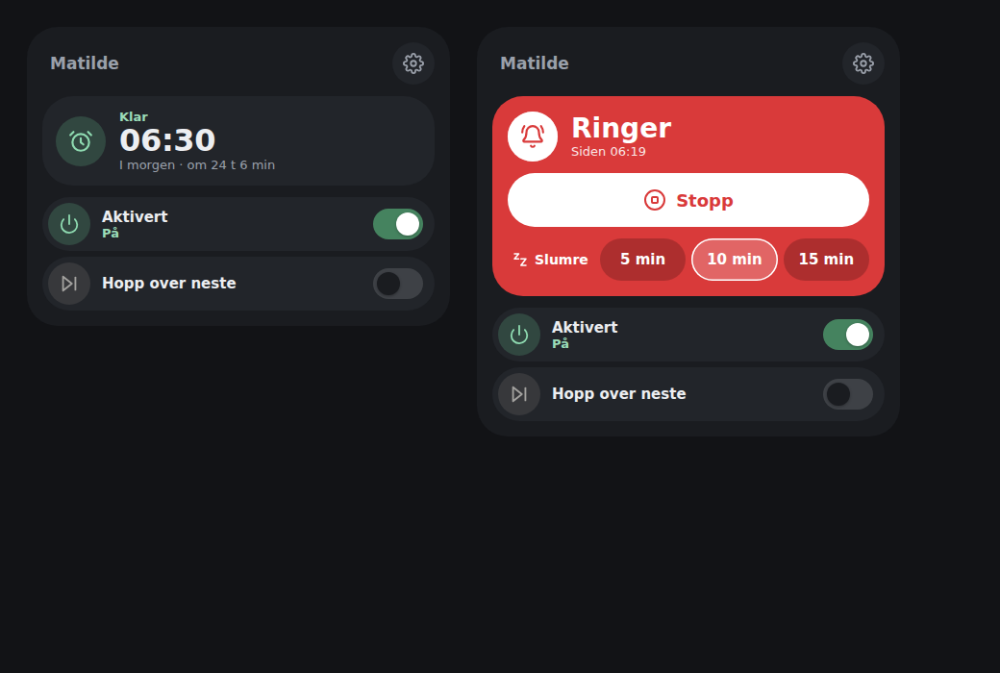
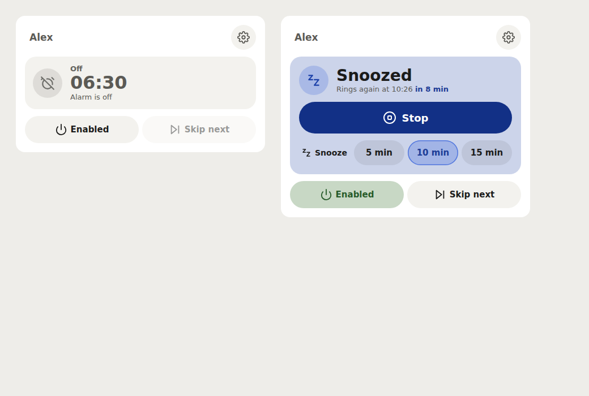
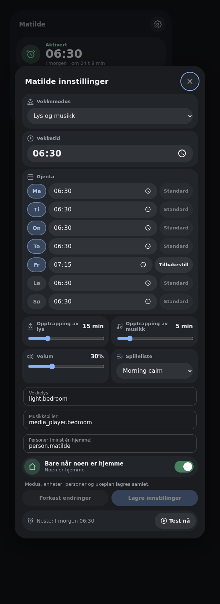

# Lovelace Personal Wakeup Card

A dashboard card for the
[Personal Wakeup](https://github.com/mvheimburg/personal-wakeup)
integration.



The card face holds only what you need in the morning:

- A status panel with the next alarm time as the headline, the day and a
  countdown. When the alarm is off it shows the configured time dimmed.
- While the alarm is waking you up, ringing or snoozed, the panel takes over
  the card with a big **Stop** button and one-tap **Snooze** presets. Ringing
  turns the panel solid red with a white Stop button; waking up and snoozed
  use a softer tint.
- The alarm time is when you wake: the light's sunrise runs for the **Light
  fade** before it and is fully up at the alarm time; music starts then. The
  armed panel says when the sunrise begins (*Sunrise from 06:15*), and during
  it when the light is fully up. **Brightness at wake-up** (10–100%, in the
  settings) sets how bright the light gets.
- With **Lights only** there is nothing to snooze: the panel offers **Stop**
  only while the light is rising, which stops the fade where it is, and goes
  back to the next alarm once the light is up. The card follows the
  integration's `can_stop` and `can_snooze`, so this needs Personal Wakeup
  **0.6.0**; with an older integration Stop and Snooze show as before.
- **Enabled** and **Skip next** switches. Both switch back to the value Home
  Assistant reports if a request fails, and they are disabled while the alarm
  entity is unavailable.
- The round **Configure** button (top right) opens the settings dialog for
  everything else: wake mode, alarm time, repeat days and daily times, fades,
  volume, playlist, wakeup light, music player, people, **Only when home**, and
  **Test now**.



- Select the wakeup light, music player, and optional people in the dialog.
  These selections persist in the integration options. Changing a selection
  stops an active alarm or snooze before applying it.
- Close settings with the close button, Escape, or a click outside the dialog.
- Failed service calls show a Home Assistant toast instead of failing silently.

On a phone the Stop button and the snooze presets are sized for a half-asleep
thumb:




### Redesign (0.5.0)

Version 0.5.0 restyles the card to match the other cards in this family
(House State, Water Guard, Access Control): a muted title with a round
Configure button, a status panel with a large headline, pill-shaped controls,
grouped rows with round icons, and inline icons. Behaviour, services,
configuration keys and the visual editor are unchanged.

## Wakeup configuration (0.4.0)

New controls require **Personal Wakeup integration 0.4.0 or later**. An older
integration keeps its existing controls and shows an upgrade notice.

- Choose **Lights only**, **Music only**, or **Lights and music**. Only enabled
  channels show their target selectors, fades, volume and playlist controls.
  Select any missing target, then press **Save configuration** to apply the mode
  and targets together. Changing these settings stops an active alarm.
- Select multiple people. **Only when home** allows scheduled alarms when any
  selected person is home; unavailable/unknown people do not count as home.
  Clearing the selection removes presence restrictions. Test now and snooze
  remain manual actions and bypass presence checking.
- Each of the seven weekday rows has an enabled button and a time. **Default**
  inherits Alarm time; editing a day's time creates an override. **Reset** removes
  that override. Disabled days retain their times. At least one day must remain
  selected; turn off **Enabled** to suspend all alarms.
- Mode, targets, people, enabled weekdays and daily overrides are staged until
  **Save configuration**. Closing the dialog retains drafts; **Discard changes**
  restores reported settings. Errors retain the draft and appear in the dialog
  and a Home Assistant toast. Other controls apply immediately.

The card uses the alarm sensor's friendly name unless `name` is explicitly set
in the card configuration. Integration 0.4.0 names new sensors after their alarm
entry; existing entity IDs and manually customized names remain stable.

## Install

### HACS
Add this repository as a custom repository (category *Dashboard*) and install
**Personal Wakeup Card**. HACS registers the resource for you.

### Manual
1. Copy `dist/lovelace-personal-wakeup-card.js` to `config/www/`.
2. Add `/local/lovelace-personal-wakeup-card.js` as a *JavaScript module*
   resource under **Settings → Dashboards → Resources**.

## Card config

```yaml
type: custom:lovelace-personal-wakeup-card
entity: sensor.matilde_wakeup
name: Matilde           # optional, defaults to the entity's friendly name
snooze_presets: [5, 10, 15]   # optional, minutes; the entity's default snooze is always included
```

The visual editor offers the same options.

## Appearance

Choose **Default** or **Bubble** in the dashboard card editor, or add
`appearance: bubble` to the card YAML. Omitting it keeps the default appearance.
The Bubble preset styles both the compact card and its settings dialog; it does
not require Bubble Card to be installed.

Both appearances use your Home Assistant theme: `--card-background-color` and
`--secondary-background-color` for surfaces, and `--success-color`,
`--warning-color`, `--error-color`, `--primary-color` and
`--disabled-text-color` for armed, waking up, ringing, snoozed and off. They
work in light and dark themes. The Bubble preset also reads
`--bubble-main-background-color`, `--bubble-secondary-background-color`,
`--bubble-accent-color`, `--bubble-border-radius`, `--bubble-icon-border-radius`,
`--bubble-sub-button-border-radius`, `--bubble-border`, and
`--bubble-box-shadow`. Without overrides it uses the current HA theme colors
and rounded Bubble-style defaults.

For example, in an HA theme (theme keys omit the leading `--`):

```yaml
bubble-border-radius: 28px
bubble-accent-color: "#009688"
```

CSS applied locally inside another Bubble Card does not carry over. This is
a visual preset, not support for Bubble Card modules or its pop-up engine.

## Build

```bash
npm ci
npx playwright install chromium
npm test          # real card DOM and service payloads in Chromium
npm run lint
npm run typecheck
npm run build      # writes dist/lovelace-personal-wakeup-card.js
node scripts/screenshot.cjs   # regenerates images/ with simulated data
```

CI checks that `dist/` is committed up to date. Releases are automatic: bump
`version` in `package.json`, merge to `main`, and the release workflow tags
`v<version>` and attaches the built card to a GitHub release.

## Language

Card controls, status labels, schedules, settings, accessibility labels and the visual editor follow Home Assistant's frontend language (`hass.language`, falling back to `hass.locale.language`). Bokmål is available for `nb`/`nb-NO`, with legacy `no` and `nn` aliases; matching ignores case and accepts underscores. Other languages fall back to English. Changing the frontend language updates the card and editor immediately.

Custom titles, entity friendly names, playlist names and backend error details are shown unchanged. Service names, entity IDs, weekday keys and configuration values remain unchanged. The static card-picker registration uses the English product name and description because it has no Home Assistant language context.

## Color schemes

Choose **Color scheme** in the card's visual editor. The setting is per card and
works with both **Default** and **Bubble** appearance, including in-card dialogs.
Every card supplied by this package offers the same choices:

| Scheme | YAML value | Palette |
| --- | --- | --- |
| Home Assistant (default) | `home-assistant` | Follows your dashboard theme and Bubble color variables |
| Bright | `bright` | White surfaces with blue accents |
| Warm | `warm` | Ivory surfaces with warm brown accents |
| Mint | `mint` | Pale green surfaces with green accents |
| Sky | `sky` | Pale blue surfaces with blue accents |
| Lavender | `lavender` | Pale purple surfaces with purple accents |

For example, add these options to your existing card configuration:

```yaml
appearance: bubble
color_scheme: mint
```

The five light schemes stay light even on a dark dashboard and override inherited
colors only within this card. Status colors retain their meaning (green for
success, amber for warnings and red for errors). Remove `color_scheme` or choose
**Home Assistant** to follow the dashboard again. Existing configurations keep
their current appearance. Scheme names and the editor label support English and
Norwegian Bokmål; YAML values remain unchanged in either language. Static
card-picker metadata remains English because it has no Home Assistant language
context.
